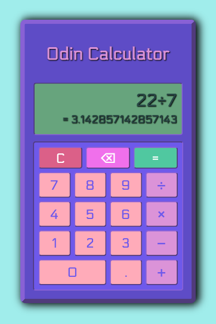
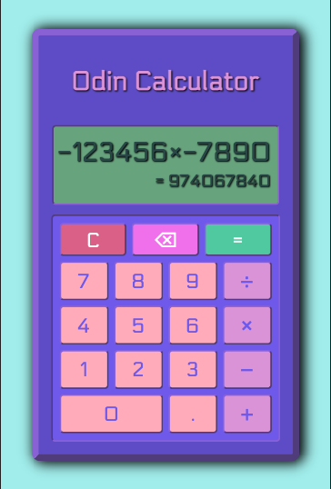

# odin-calculator

**LIVE DEMO: https://olzcodes.github.io/odin-calculator/**

The aim of this project was to build a basic calculator.

https://www.theodinproject.com/lessons/foundations-calculator

## Screenshots

Basic calculation

Basic calculation with negative numbers and decimals

## To-Do

- [DONE] Create basic calculator interface
- [DONE] Add operator functions
- [DONE] Add Clear button
- [DONE] Add Backspace (Delete) button
- [DONE] Upgrade display from 1 line to 2 lines
- [DONE] Enable automatic calculation upon input
- [DONE] Enable input of negative numbers
- [DONE] Prevent invalid input (or autocorrect where possible)
  - [DONE] Prevent negative zero input
  - [DONE] Automatically add a leading zero to decimals, if missing
  - [DONE] Prevent input of multiple leading zeros
  - [DONE] Prevent multiple decimal points in one number
  - [DONE] Automatically remove redundant decimal points
- Improve handling of display overflow
- Improve handling of inaccuracies arising from floating point calculations e.g.  
  0.1 + 0.2 = 0.3000000000000004  
  0.3 + 0.6 = 0.8999999999999999

## What I learned from this project

- Decisions around data structures set the foundation for a project. Choosing inadequate data structures will hinder progress and require time to fix.
- As a solo developer with no deadline, scope creep can be a serious challenge. Adding more features or improving on existing ones is often highly tempting. This usually ends up adding layers of complexity to the project.
- Some decimal (base-10) calculations lack precision as certain decimal values cannot be represented accurately in a computer's binary (base-2) number system.
- Fixing a bug can give rise to other bugs. A rigorous approach to testing can help avoid this.
